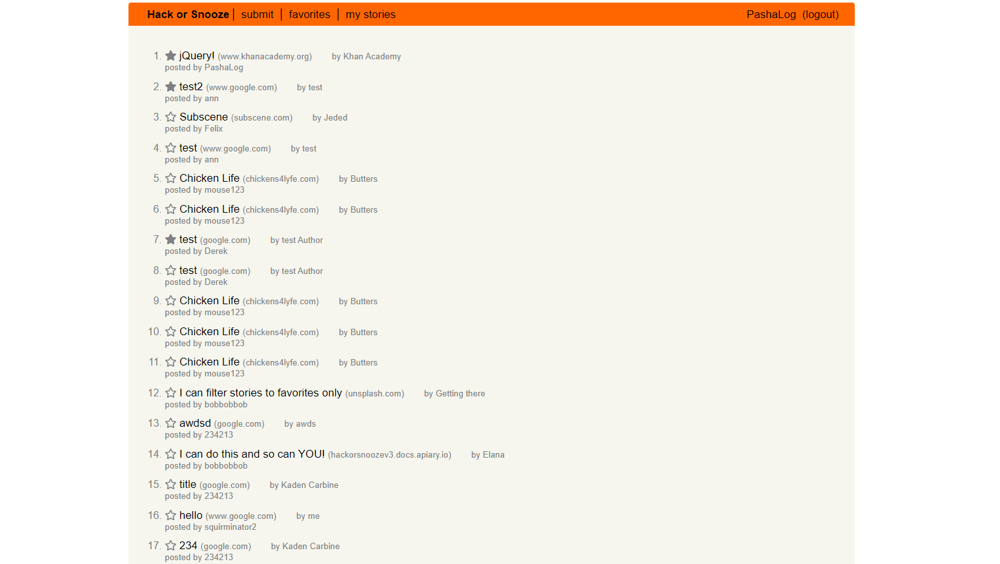

# A Hacker News Clone (Hack or Snooze) 

## Description 

A clone of the [Y Combinator Hacker News](https://news.ycombinator.com/) website where people can post articles about programming that they find interesting. Built with Object Oriented Programming methods.

### Technologies Used: 

* [JavaScript](https://www.javascript.com/)
* [jQuery](https://jquery.com/)
* [Axios](https://axios-http.com/docs/intro)

### **How to Operate:**

First, click on the login/signup button to create an account. Then you are free to submit anything you want, and favorite any postings that you find interesting! 
You can come back and see your favorites and submissions, or you can unfavorite and delete your stories. Up to you.
